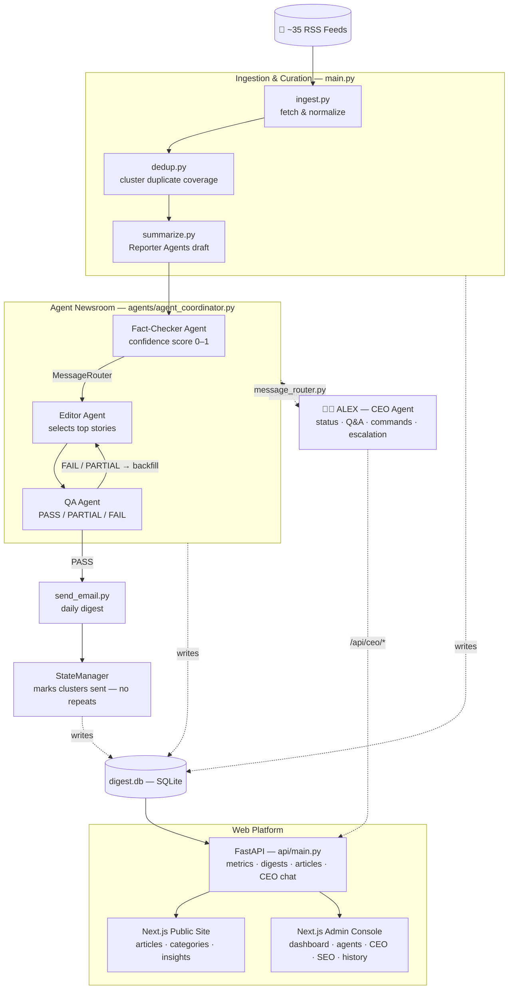
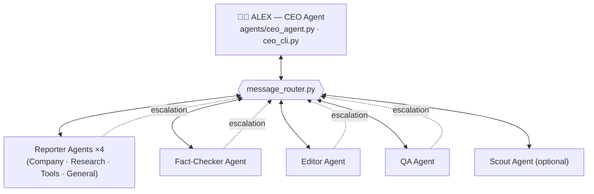

# Autonomous AI News Agency

A self-running multi-agent system that ingests AI news from ~35 RSS feeds, clusters
duplicate coverage, has specialized AI agents write and validate each story, and emails
a daily digest — with zero human intervention and zero duplicate sends across runs.

## Architecture

### Pipeline & platform flow



### Agent communication (hub-and-spoke)



Every agent inherits from `agents/base_agent.py`, which provides Claude → Groq LLM
fallback, retries with backoff, a circuit breaker, and structured logging — so
specialized agents only implement their editorial logic. If both LLM providers'
circuit breakers trip open, `agents/degraded_mode.py` takes over with rule-based
clustering/scoring and a CRITICAL escalation fires to ALEX.

## Agent Roles

| Agent | File | Responsibility |
|---|---|---|
| Reporter (×4 beats) | `agents/reporter_agent.py` | Summarize a cluster with a beat-specific lens |
| Fact-Checker | `agents/fact_checker_agent.py` | Heuristic confidence score (0–1): dates, source reputation, corroboration |
| Editor | `agents/editor_agent.py` | Select top stories; fetch backups when QA rejects stories |
| QA | `agents/qa_agent.py` | Validate the final selection: PASS / PARTIAL (needs backup) / FAIL |
| CEO "ALEX" | `agents/ceo_agent.py` | Status reports, board Q&A, strategic commands, escalation |
| State Manager | `agents/state_manager.py` | Tracks sent clusters so nothing is ever emailed twice |
| Degraded Mode | `agents/degraded_mode.py` | Rule-based clustering/scoring fallback if both LLMs are down |

Full protocol and extension guide: [agents/README.md](agents/README.md).

## Setup

1. Install dependencies:
   ```
   pip install -r requirements.txt
   ```

2. Copy `.env.example` to `.env` and fill in `ANTHROPIC_API_KEY`, `GROQ_API_KEY` (fallback),
   SMTP settings, and `DIGEST_RECIPIENT`. See [DEPLOYMENT.md](DEPLOYMENT.md) for details.

3. Migrate/init the database:
   ```
   python3 db_migrate.py   # safe to re-run — idempotent
   ```

4. Run the pipeline:
   ```
   python3 main.py
   ```

## Talking to the CEO Agent

```
python3 ceo_cli.py status              # executive summary
python3 ceo_cli.py status --detailed   # + agent-level performance
python3 ceo_cli.py ask "How many stories did we send this week?"
python3 ceo_cli.py command "Switch to weekly digest mode"
python3 ceo_cli.py metrics             # raw performance/health numbers
```

## Notes

- **Idempotent & duplicate-free**: `StateManager` marks every sent cluster; dedup and
  summarize stages exclude sent content, so re-running the pipeline never repeats a story.
- **Resilient by default**: Claude → Groq → rule-based degraded mode. A CRITICAL escalation
  fires to the CEO Agent if both LLM providers' circuit breakers trip open.
- **Editing sources**: add/remove RSS feeds in `config.py` → `FEEDS`.
- **Observability**: every agent action is logged to the `agent_logs` table
  (`utils/agent_logger.py`); roll it up with `utils/metrics_collector.py` or `ceo_cli.py metrics`.

## Scheduling it (cron example)

```
0 7,17 * * * cd /path/to/NEWletter && /usr/bin/python3 main.py >> run.log 2>&1
```

## Optional extras (Phase 5)

- **Scout Agent** (`agents/scout_agent.py`) — discovers/validates/prunes RSS sources. Run: `python3 -m agents.scout_agent`
- **LangGraph orchestration** (`agents/orchestration_graph.py`) — graph-based pipeline with conditional QA↔Editor edges and parallel fact-checking. Enable with `USE_LANGGRAPH_ORCHESTRATION=1`.
- **Weekly digest mode** — `python3 ceo_cli.py command "switch to weekly mode"` widens the lookback to 7 days and applies stricter "Best of" curation.
- **Web dashboard** (`api/` + `web/`) — FastAPI backend + Next.js frontend for CEO chat and live metrics. See [web/README.md](web/README.md).

## Docs

- [agents/README.md](agents/README.md) — agent responsibilities & message protocol
- [DEPLOYMENT.md](DEPLOYMENT.md) — environment variables, migration, deploy steps
- [TROUBLESHOOTING.md](TROUBLESHOOTING.md) — common issues & recovery procedures
- [web/README.md](web/README.md) — dashboard run/deploy steps
- `.kiro/specs/autonomous-ai-news-agency/tasks.md` — implementation task list
